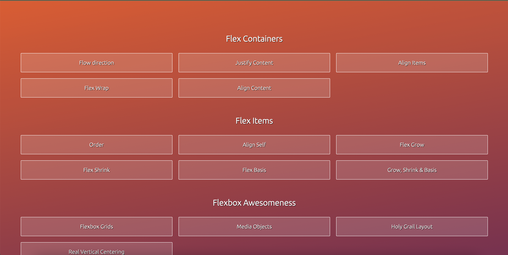

# Master CSS3 Flexbox for Good



Welcome to the GitHub repository for the Udemy course "Master CSS3 Flexbox for Good" by Peter Sommerhoff. In this repository, you will find all the code examples, exercises, and resources associated with the course.

## About the Course

**Course Name:** Master CSS3 Flexbox for Good
**Instructor:** Peter Sommerhoff
**Course Duration:** [2 hours]
**Course Link:** [https://shorturl.at/owX03)

## Course Description

CSS Flexbox is a powerful layout tool that simplifies the design of complex layouts and makes responsive web design easier than ever. In this course, you will learn everything you need to know about CSS Flexbox, from the basics to advanced techniques.

## Course Content

This repository contains the following content:

1. **Example Code:** You will find the code examples used in the course organized by section and lecture. These examples will help you understand how Flexbox works in practice.

2. **Exercises:** Practice makes perfect! We have included a set of exercises for you to work on. These exercises will challenge your understanding of Flexbox and help reinforce your skills.

3. **Resources:** We have compiled a list of resources that complement the course material. These resources include articles, documentation, and additional tutorials to further enhance your knowledge of CSS Flexbox.

## How to Use This Repository

1. **Clone the Repository:** To get started, clone this repository to your local machine using the following command:

   ```
   git clone https://github.com/Sadeesha_Jayaweera/Master-CSS3-Flexbox-for-Good.git
   ```

2. **Navigate Sections:** Use the folder structure to navigate to specific sections and lectures. Each section folder contains its own set of code examples and exercises.

3. **Practice:** Work through the code examples and exercises to gain hands-on experience with CSS Flexbox. Feel free to modify and experiment with the code to see how different changes affect layouts.

4. **Explore Resources:** Check out the resources folder for additional reading material and useful links related to Flexbox.

## Getting Help

If you encounter any issues or have questions about the course content, feel free to create an issue in this repository. You can also connect with your fellow students on the Udemy course platform for additional support and discussion.

## Contribution

If you have any improvements or suggestions for this repository, please feel free to contribute by creating pull requests. We welcome contributions from the community to make this resource even better!

## License

This repository and its contents are provided under the [MIT License](LICENSE). Please review the license file for more details.

Happy learning, and may you master CSS3 Flexbox for good! 😃


